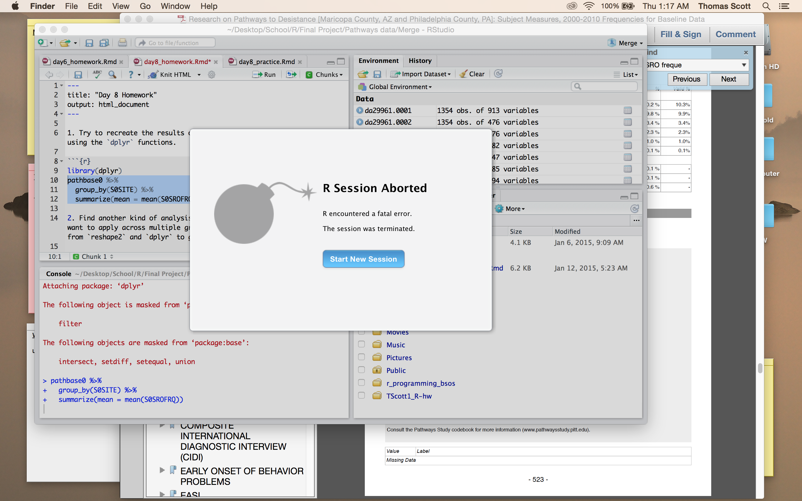

1. Try to recreate the results of Homework 6 (or your intended results) using the `dplyr` functions.

```{r}
library(dplyr)
summary(pathbase0$S0SROFRQ)
pathbase0 %>%
  group_by(pathbase0$S0SGEND) %>%
  summarise(mean = mean(S0SROFRQ))
#for some reason this makes R abort with a bomb signal. I have never seen that before.
getwd()
setwd("~/Desktop/R_HW")

```

2. Find another kind of analysis/transformation/summary stat that you want to apply across multiple groups in your data. Use the functions from `reshape2` and `dplyr` to get these results.

```{r}

pathbase0 %>%
  group_by(S0ETHN_R) %>%
  summarize(mean = mean(S0SRO6))
```

# This also destroyed my work and exited out of R. Another issue is I have about 6 different longitudinal files, some numeric only some not, and none of them are acting properly. 

3. For more practice, try another example of something like #2 (find another stat or grouping or something).

4. Do yet another case of #2 above, but this time throw in a transformation, too.